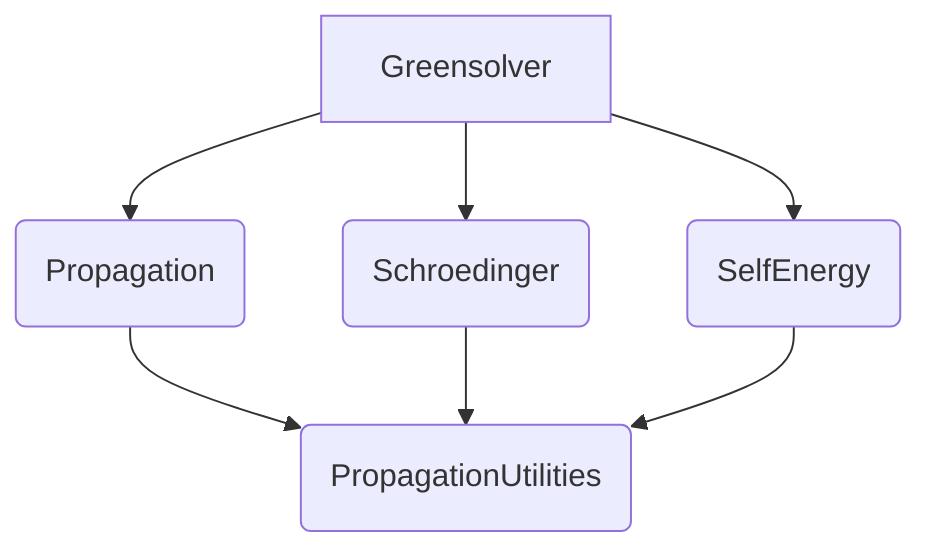

# Simulation Framework Architecture

This document outlines the architecture of the simulation framework, detailing the interaction between its core components.

## Overview

The simulation framework is designed to perform complex quantum mechanical simulations. It is built upon a set of interconnected C++ components, each responsible for specific aspects of the simulation process. The main components are `Greensolver`, `Propagation`, `Schroedinger`, `SelfEnergy`, and various utility classes.

## Core Components and Interactions

The following diagram and descriptions illustrate how the core components interact:

* **`Propagation`**: This component forms the foundation for managing momentum meshes and `Propagator` objects. It handles the discretization of momentum space and provides the basic framework for propagating quantum states.
* **`Greensolver`**: Inheriting from `Propagation`, the `Greensolver` component is central to the simulation. It utilizes the momentum meshes and propagator functionalities from `Propagation`. Its primary role is to solve Green's functions. To achieve this, it interacts with:
  * **`Schroedinger`**: To obtain the Hamiltonian of the system and its corresponding eigenvalues and eigenvectors.
  * **`SelfEnergy`**: To incorporate self-energy corrections into Green's function calculations. These self-energies account for interactions within the system.
* **`Schroedinger`**: This component is responsible for constructing the Hamiltonian of the quantum system being simulated. It then performs eigensolving operations to find the energy eigenvalues and eigenvectors, which are crucial for understanding the system's properties and are used by `Greensolver`.
* **`SelfEnergy`**: This component calculates the self-energies of the particles in the system. Self-energies represent the effects of interactions on the particle's propagation. These calculated self-energies are then fed back into the `Greensolver` to refine the Green's function calculations.
* **`PropagationUtilities`** (and other utilities): This collection of utility classes provides essential support functions and data structures used by multiple components. For instance, `PropagationUtilities` might offer tools for managing and manipulating the momentum meshes used by `Propagation`, or mathematical routines required by `Schroedinger` for Hamiltonian construction, or by `SelfEnergy` and `Greensolver` for their calculations.

## Simulation Flow

A typical simulation proceeds as follows:

1. **Initialization**: The `Propagation` component sets up the momentum meshes.
2. **Hamiltonian Construction**: The `Schroedinger` component constructs the system's Hamiltonian and solves for its eigenvalues and eigenvectors.
3. **Self-Energy Calculation**: The `SelfEnergy` component calculates the necessary self-energies.
4. **Green's Function Solution**: The `Greensolver`, using information from `Schroedinger` and `SelfEnergy`, and its inherited capabilities from `Propagation`, solves for the Green's functions of the system.

This modular architecture allows for flexibility and extensibility, enabling different physical models and numerical techniques to be incorporated into the framework.
